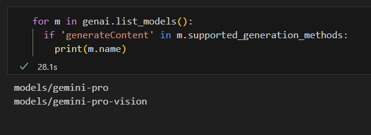

Google introduced the Gemini models on December 6, 2023, and mentioned that Bard would use the new Gemini Pro model. However, this feature is not yet available in the UK or EU, probably because of regulatory issues. Right now, the only way to access the Gemini Pro model is through the Vertex AI APIs....

Google's Gemini has gained attention as a significant rival to OpenAI's GPT. It's an exciting development! However, there's curiosity about the actual performance and capabilities of Gemini..

